# Reference-led v2 update / Bản dựng lại v2

Bản `index.html` hiện tại đã được dựng lại theo ảnh B-52D và cầu Long Biên, thêm khu dân cư dày, mảnh văng/cấu kiện sập và hồ sơ lịch sử riêng từng chương. Xem [README_V2.md](README_V2.md), [QA_V2.md](QA_V2.md) và [REPRODUCE_V2.md](REPRODUCE_V2.md). Các phần giới thiệu/ảnh phía dưới được giữ lại từ bản phát hành cũ để không xóa lịch sử dự án.

The current local build is v2. It includes reference-led aircraft/bridge reconstruction, denser neighborhoods, persistent simulated debris, structural pieces and per-chapter history. It remains an interpretive reconstruction, not a surveyed 1972 city or a validated blast model. Earlier gallery content is retained below as project history. No remote publication was performed as part of this update.

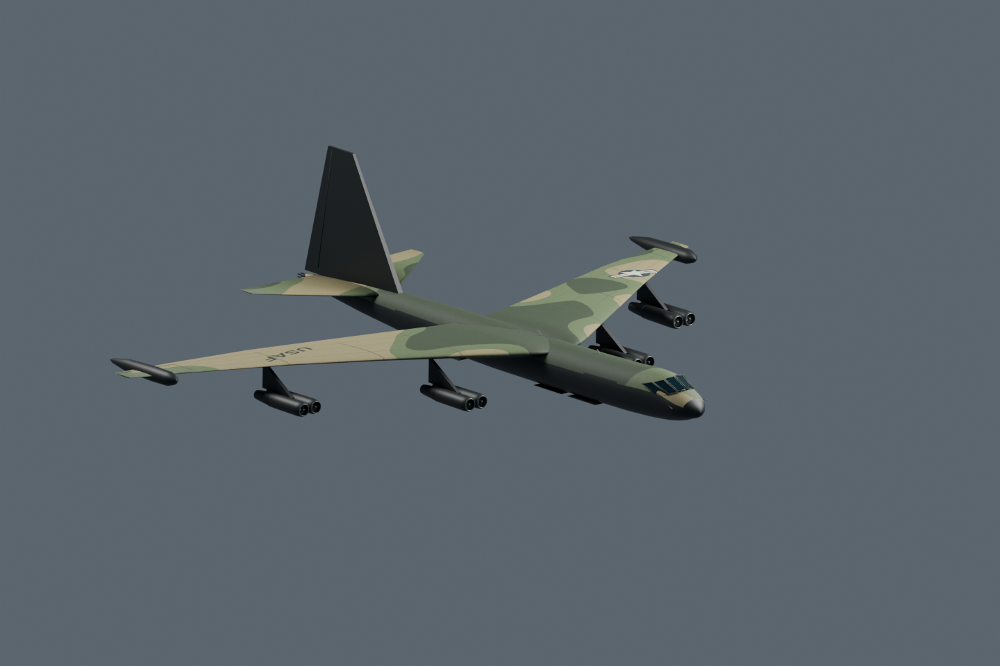
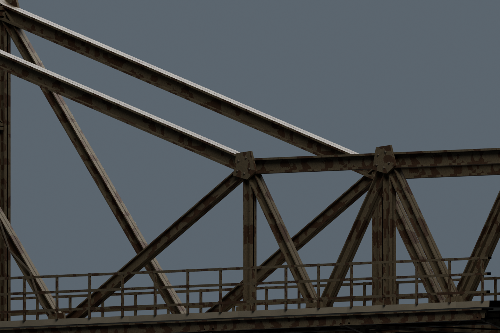
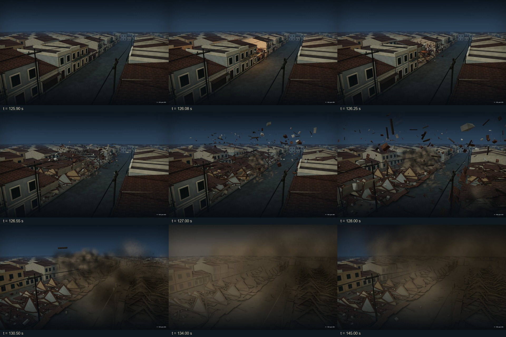

---

# Những đêm tháng Chạp — Miền Bắc 1972

**VI:** Bản phục dựng 3D tương tác, chạy ngoại tuyến trong một tệp HTML, tái hiện theo hướng diễn giải một số địa điểm và lát cắt lịch sử ở miền Bắc Việt Nam trong tháng 12/1972. Dự án gồm bản web Three.js, nguồn Blender, mã dựng cảnh, hồ sơ nguồn lịch sử và bộ QA có thể tái lập.

**EN:** An offline interactive 3D historical interpretation of selected locations and events in Northern Vietnam during December 1972. The repository includes the Three.js web experience, Blender sources, scene-generation code, historical-source notes, and reproducible QA evidence.

> Đây là **phục dựng diễn giải có dàn dựng điện ảnh**, không phải phim tư liệu, bản quét hiện trường, mô phỏng vật lý chính xác hay bản sao nguyên trạng từng địa điểm năm 1972.
> This is an **interpretive cinematic reconstruction**, not archival footage, a site scan, an exact physics simulation, or a literal survey-grade recreation of every 1972 location.

<!-- README_GALLERY_START -->
## Hình ảnh / Screenshots

<p align="center">
  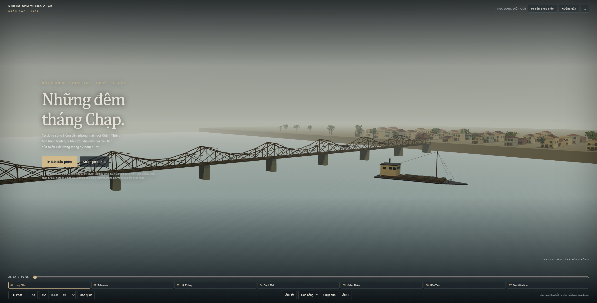
</p>
<p align="center"><sub><strong>Cầu Long Biên, Hà Nội / Long Bien Bridge, Hanoi</strong> — cảnh mở đầu định vị không gian / opening establishing shot.</sub></p>

<table>
  <tr>
    <td width="50%" valign="top">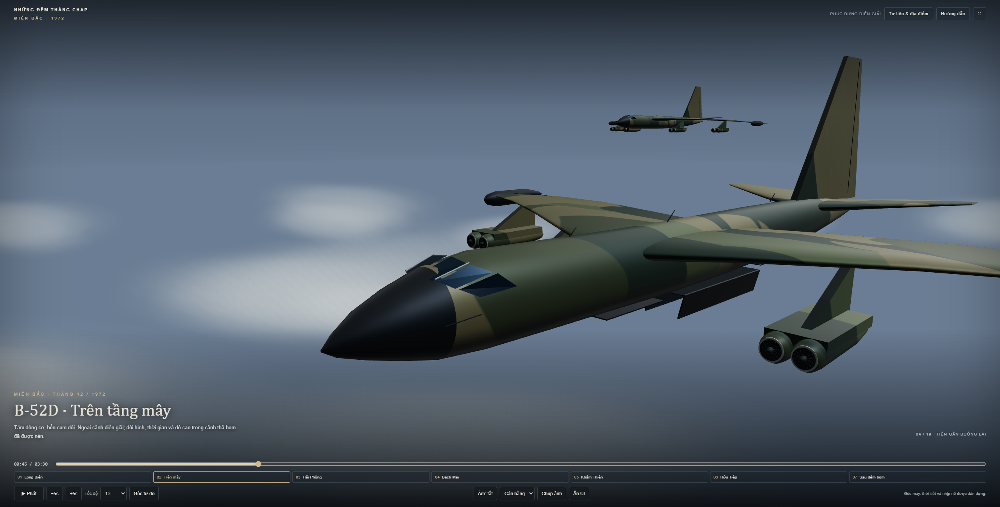<br><sub><strong>B-52D — cận cảnh / close view.</strong></sub></td>
    <td width="50%" valign="top">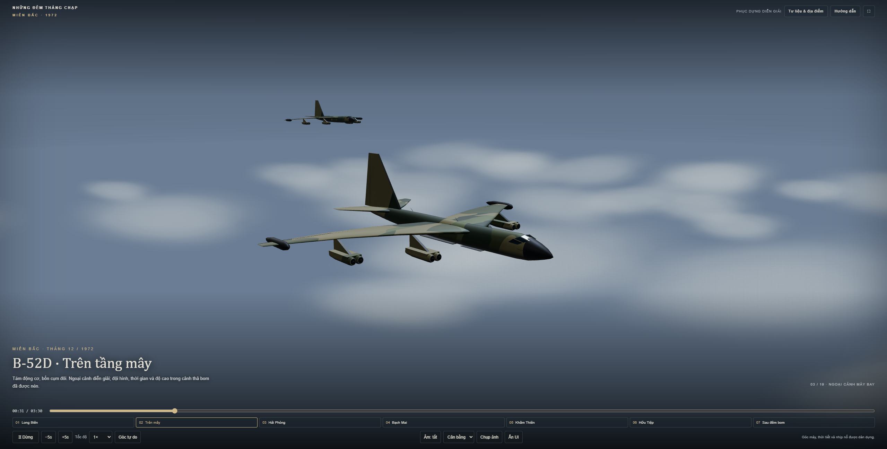<br><sub><strong>B-52D — toàn cảnh / wide view.</strong></sub></td>
  </tr>
  <tr>
    <td width="50%" valign="top">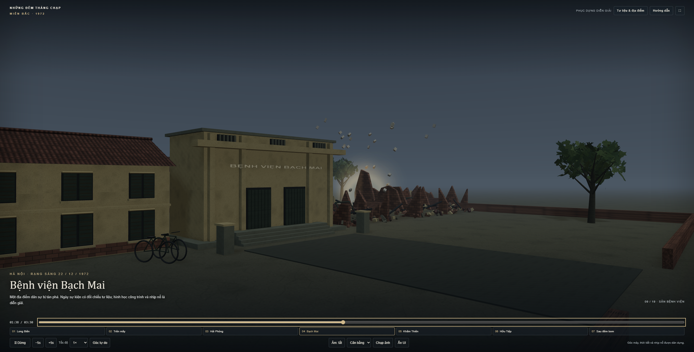<br><sub><strong>Bệnh viện Bạch Mai / Bach Mai Hospital.</strong></sub></td>
    <td width="50%" valign="top">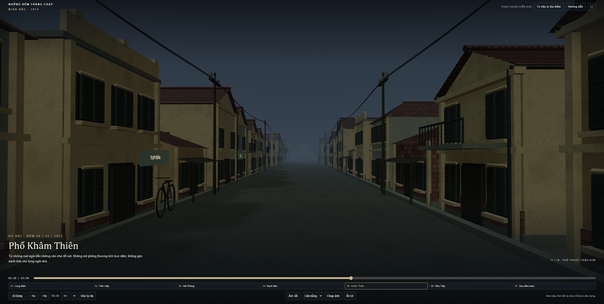<br><sub><strong>Phố Khâm Thiên / Kham Thien Street</strong> — trạng thái trước hư hại / before damage.</sub></td>
  </tr>
  <tr>
    <td width="50%" valign="top">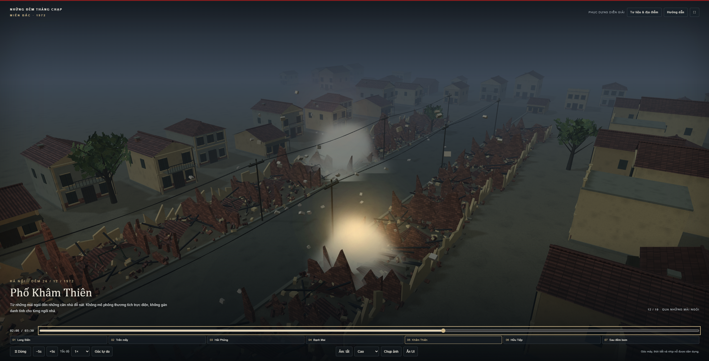<br><sub><strong>Khâm Thiên — hậu cảnh hư hại / aftermath.</strong></sub></td>
    <td width="50%" valign="top">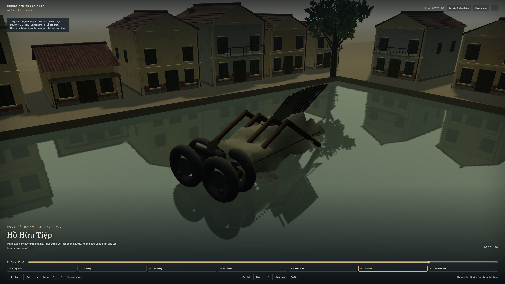<br><sub><strong>Hồ Hữu Tiệp, Ngọc Hà / Huu Tiep Lake, Ngoc Ha.</strong></sub></td>
  </tr>
</table>

<details>
<summary><strong>Tư liệu & địa điểm / Sources & locations panel</strong></summary>

<p align="center">
  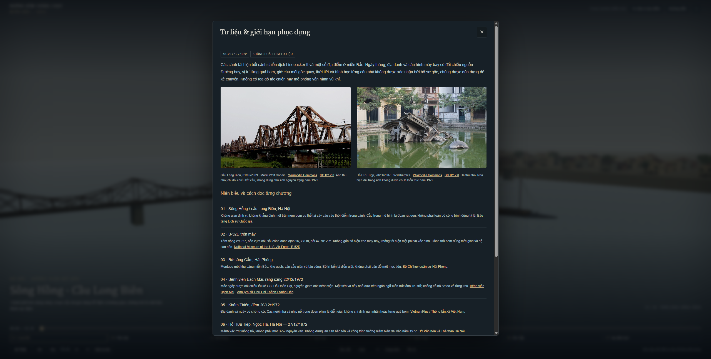
</p>

Giao diện phân biệt phần dựa trên nguồn lịch sử với phần dàn dựng. / The interface distinguishes historical-source grounding from interpretive staging.

</details>

> **VI:** Các ảnh trên là ảnh chụp trực tiếp từ bản chạy của dự án. Phần taskbar Windows thừa đã được loại khỏi bản ảnh dùng trong README; ảnh nguồn gốc trên máy không bị sửa.
> **EN:** These are direct captures of the running project. The extraneous Windows taskbar was removed from the README copies; the original screenshots on the PC were left untouched.
<!-- README_GALLERY_END -->

---

## Tiếng Việt

### Tổng quan

- Thời lượng: **210 giây**.
- Cấu trúc: **7 chương, 19 đường máy**.
- Chạy trực tiếp bằng `index.html`; không cần máy chủ hoặc kết nối mạng để phát bản đã đóng gói.
- Có chế độ góc phim và **Free View**, tua theo thời gian/chương, tốc độ **0,25×–4×**, bước từng khung hình, xuất PNG và camera JSON.
- Âm thanh tổng hợp tắt mặc định; có tùy chọn giảm chớp và rung máy.
- Hình học được dựng bằng Blender và đồng bộ tham số với bản web để kiểm tra tỷ lệ.

### Mở bản phim

1. Clone hoặc tải repository.
2. Mở `index.html` bằng Chrome hoặc Edge có tăng tốc đồ họa.
3. Không cần chạy `npm install`, Blender hay máy chủ nếu chỉ muốn xem bản đã đóng gói.

Bản đóng gói đầy đủ dạng ZIP được phát hành riêng tại [GitHub Releases](https://github.com/FagonViendra/b52-hanoi-cinematic-1972/releases) để tránh đưa binary lớn lặp lại vào lịch sử Git.

### Điều khiển

- `Space`: phát / dừng.
- Thanh thời gian hoặc nút chương: tua.
- `←` / `→`: lùi / tiến 5 giây.
- `,` / `.`: lùi / tiến 1/24 giây.
- Tốc độ: `0.25×`, `0.5×`, `1×`, `2×`, `4×`.
- `F`: chuyển giữa góc phim và Free View.
- Free View: kéo chuột để xoay/dịch, cuộn để zoom; `W A S D` di chuyển, `Q E` hạ/nâng, `Shift` tăng tốc.
- `H`: ẩn/hiện giao diện; `P`: lưu PNG; `C`: xuất camera JSON; `D`: thống kê khi ở góc phim.

### Các chương

| Thời gian | Địa điểm / chủ đề | Ghi chú |
|---|---|---|
| 00:00–00:26 | Sông Hồng / cầu Long Biên, Hà Nội | Cảnh định vị; cầu được rút gọn |
| 00:26–00:58 | Ngoại cảnh B-52D trên mây | Thời gian và độ cao được nén để trình bày |
| 00:58–01:22 | Bờ sông Cấm, Hải Phòng | Không gian cảng mang tính diễn giải |
| 01:22–01:52 | Bệnh viện Bạch Mai | Gắn mốc rạng sáng 22/12/1972 |
| 01:52–02:34 | Khâm Thiên, Hà Nội | Gắn mốc đêm 26/12/1972 |
| 02:34–03:02 | Hồ Hữu Tiệp, Ngọc Hà | Gắn mốc 27/12/1972; dựng mảnh xác |
| 03:02–03:30 | Sau những đêm bom | Cảnh suy tưởng; ánh sáng bình minh được dàn dựng |

Các chương thuộc những thời điểm khác nhau; không nên hiểu các đường cắt dựng thành một phi vụ hoặc đường bay liên tục.

### Cấu trúc repository

- `index.html` — bản chạy ngoại tuyến đã đóng gói.
- `src/` — mã tạo hình, cảnh, camera, điều khiển và kiểm thử.
- `assets/Northern_Vietnam_1972.blend` — thư viện Blender.
- `assets/library.glb` — hình học xuất từ Blender.
- `assets/recipe.json` — tham số dùng chung giữa web và Blender.
- `assets/blender_measurements.json` — dữ liệu đo kiểm.
- `references/` — ảnh tham chiếu có thông tin giấy phép.
- `qa/` — ảnh render, log, kiểm thử chức năng và so sánh.
- `HISTORY_SOURCES.md` — nguồn lịch sử và ranh giới giữa chứng cứ với phần dàn dựng.
- `REPRODUCE.md` — hướng dẫn tái lập.
- `QA_REPORT.md` — kết quả kiểm tra.
- `ISSUE_LOG.md` — lỗi đã gặp, cách xử lý và giới hạn còn lại.
- `MANIFEST_SHA256.json` — checksum của bộ bàn giao.

### QA và tái lập

Bộ bàn giao cuối ghi nhận:

- **39/39** mục chức năng đạt trong hai lượt kiểm tra độc lập cuối.
- **57** ảnh đầu/giữa/cuối của 19 đường máy và **6** góc render Blender đã được kiểm tra trực quan.
- Phát đủ 210 giây ở 4× và dừng đúng cuối phim.
- Bản đóng gói chạy offline, không tải thư viện/tài sản từ mạng.
- Không ghi nhận lỗi JavaScript hoặc shader trong các lượt kiểm tra cuối.
- Bản dựng lại từ cùng nguồn đã được kiểm tra cho kết quả giống từng byte trong quy trình bàn giao; checksum nằm trong hồ sơ QA/manifest.

Một phép so ảnh hồ từng ghi nhận sai khác rất nhỏ: 7 pixel trên 1.296.000 pixel, chênh tối đa 1 mức màu 8-bit. Chi tiết và ngưỡng kiểm tra nằm trong `QA_REPORT.md` và `REPRODUCE.md`.

### Dựng lại

```bash
npm ci
node build.mjs
```

Blender chỉ cần khi muốn tái tạo hoặc chỉnh sửa tài sản 3D. Xem `REPRODUCE.md` trước khi thay đổi pipeline để giữ seed, tham số, quy ước trục và phép kiểm tra nhất quán.

### Nguồn và giấy phép bên thứ ba

Dự án tách phần có chứng cứ lịch sử khỏi phần dàn dựng. Xem `HISTORY_SOURCES.md` trước khi suy rộng bất kỳ chi tiết nào của cảnh. Các phụ thuộc/tài sản bên thứ ba và thông tin giấy phép được ghi trong `THIRD_PARTY_LICENSES.txt` và hồ sơ tham chiếu tương ứng.

### Giới hạn đã biết

- Kiến trúc là diễn giải, chưa phải bản đo từng công trình.
- Cầu được rút gọn; bom, khói, nổ và chuyển trạng thái hư hại không phải mô phỏng vật lý chính xác.
- Free View có thể xuyên vật thể vì không có va chạm vật lý đầy đủ.
- Chưa kiểm thử Safari, điện thoại thật hoặc chạy liên tục nhiều giờ.

---

## English

### Overview

- Runtime: **210 seconds**.
- Structure: **7 chapters, 19 camera paths**.
- Runs directly from `index.html`; the packaged experience does not require a web server or network connection.
- Includes cinematic mode and **Free View**, timeline/chapter seeking, **0.25×–4×** playback speed, frame stepping, PNG capture, and camera JSON export.
- Synthetic audio is off by default; reduced-flash and reduced-camera-shake options are available.
- Blender geometry and the web build share parameters used for scale checks.

### Run

1. Clone or download the repository.
2. Open `index.html` in a hardware-accelerated Chrome or Edge browser.
3. You do not need `npm install`, Blender, or a local server just to play the packaged build.

The complete packaged ZIP is distributed through [GitHub Releases](https://github.com/FagonViendra/b52-hanoi-cinematic-1972/releases) instead of duplicating a large binary inside Git history.

### Controls

- `Space`: play / pause.
- Timeline or chapter buttons: seek.
- `←` / `→`: step backward / forward by 5 seconds.
- `,` / `.`: step backward / forward by 1/24 second.
- Speed: `0.25×`, `0.5×`, `1×`, `2×`, `4×`.
- `F`: switch between cinematic mode and Free View.
- Free View: drag to rotate/pan, wheel to zoom; `W A S D` move, `Q E` descend/ascend, `Shift` accelerates movement.
- `H`: toggle UI; `P`: save PNG; `C`: export camera JSON; `D`: show statistics in cinematic mode.

### Chapters

| Time | Location / subject | Note |
|---|---|---|
| 00:00–00:26 | Red River / Long Bien Bridge, Hanoi | Establishing sequence; bridge is simplified |
| 00:26–00:58 | B-52D above the cloud layer | Time and altitude are compressed for presentation |
| 00:58–01:22 | Cam River waterfront, Hai Phong | Interpretive port environment |
| 01:22–01:52 | Bach Mai Hospital | Anchored to the early hours of 22 Dec 1972 |
| 01:52–02:34 | Kham Thien, Hanoi | Anchored to the night of 26 Dec 1972 |
| 02:34–03:02 | Huu Tiep Lake, Ngoc Ha | Anchored to 27 Dec 1972; depicts wreckage |
| 03:02–03:30 | After the bombing nights | Reflective sequence; dawn lighting is staged |

These chapters refer to different dates and contexts. The edit should not be interpreted as one continuous mission or flight path.

### Repository layout

- `index.html` — packaged offline build.
- `src/` — geometry, scene, camera, controls, and test code.
- `assets/Northern_Vietnam_1972.blend` — Blender asset library.
- `assets/library.glb` — exported geometry.
- `assets/recipe.json` — parameters shared by web and Blender builds.
- `assets/blender_measurements.json` — measurement data.
- `references/` — reference images with license metadata.
- `qa/` — renders, logs, functional tests, and image comparisons.
- `HISTORY_SOURCES.md` — historical sourcing and evidence-vs-staging boundaries.
- `REPRODUCE.md` — reproduction procedure.
- `QA_REPORT.md` — verification results.
- `ISSUE_LOG.md` — encountered issues, fixes, and remaining limitations.
- `MANIFEST_SHA256.json` — delivery checksums.

### QA and reproducibility

The final delivery records:

- **39/39** functional checks passed across the final two independent runs.
- **57** start/middle/end captures across all 19 camera paths plus **6** Blender render angles were visually inspected.
- The full 210-second sequence completed at 4× and stopped at the intended endpoint.
- The packaged build runs offline without fetching libraries or assets from the network.
- No JavaScript or shader errors were recorded in the final verification runs.
- Rebuilding from the same source was verified byte-for-byte in the delivery workflow; checksums are retained in the QA/manifest files.

One lake-image comparison recorded a deliberately documented tiny variance: 7 pixels out of 1,296,000 differed by at most one 8-bit color level. See `QA_REPORT.md` and `REPRODUCE.md` for the exact test and threshold.

### Rebuild

```bash
npm ci
node build.mjs
```

Blender is only required when regenerating or editing the 3D asset library. Read `REPRODUCE.md` before changing the pipeline so that seeds, parameters, axis conventions, and verification checks remain consistent.

### Sources and third-party licensing

The project separates historically supported claims from staged visual interpretation. Consult `HISTORY_SOURCES.md` before treating scene details as historical evidence. Third-party dependencies/assets and their licensing information are documented in `THIRD_PARTY_LICENSES.txt` and the relevant reference metadata.

### Known limitations

- Architecture is interpretive rather than survey-grade reconstruction of each structure.
- The bridge is simplified; bombs, smoke, explosions, and damage-state transitions are not exact physical simulations.
- Free View can pass through geometry because full collision handling is not implemented.
- Safari, physical mobile devices, and multi-hour continuous playback were not part of the final test matrix.